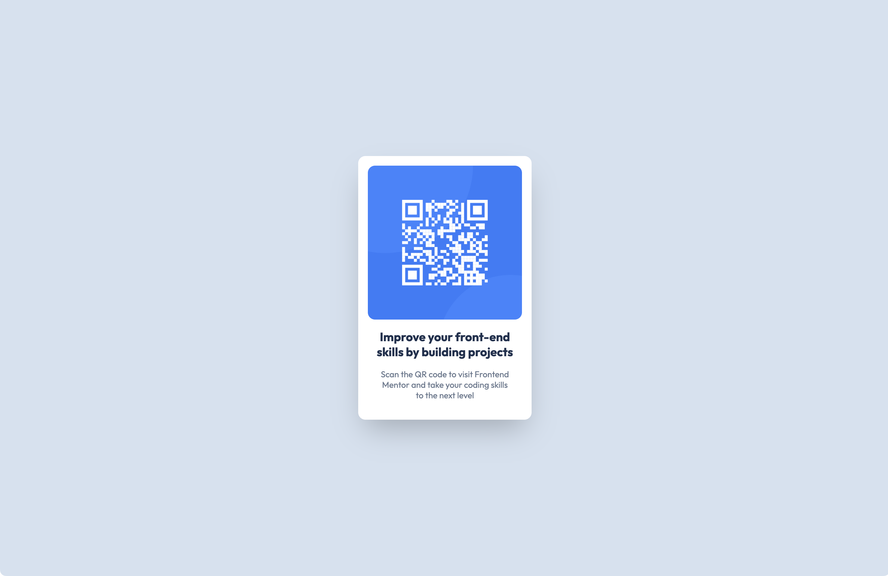

# Frontend Mentor - QR code component solution

This is a solution to the [QR code component challenge on Frontend Mentor](https://www.frontendmentor.io/challenges/qr-code-component-iux_sIO_H). All assets and design, credits to Frontend Mentor.

## Table of contents

- [Overview](#overview)
  - [Screenshot](#screenshot)
  - [Links](#links)
- [My process](#my-process)
  - [Built with](#built-with)
  - [What I learned](#what-i-learned)
  - [Continued development](#continued-development)

## Overview

### Screenshot

Well that was weird.

### Links

- Live Site URL: [Add live site URL here](https://qr-code-component.frilly.dev)

## My process

### Built with

- Vue 3
- Tailwind

### What I learned

I thought that you add more styles to tailwind by the `extend` section, I didn't know you could override the default styles also, tried to do that outside `extend` and all colors were gone except slate-300, 500 and 900.

For some reason, Vercel was refusing to build this project because of some type checking issues. I had to disable type checking to get it to build. Idk why, i'm scared.

It was pretty fun tweaking stuff to try to get as close as possible to the design.

### Continued development

Didn't use a lot of Vue features and would want to try more.
